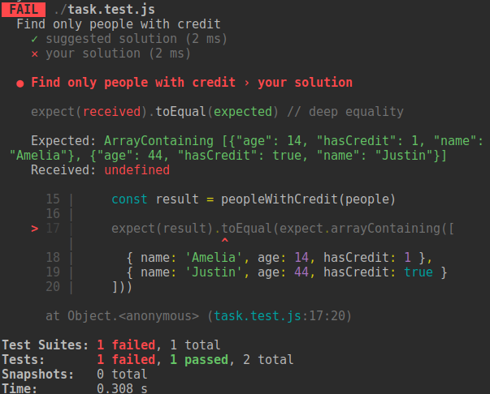

# Task

## Setup
1. This repo is a `template repository`, meaning you can click "Use this template" button to create your own repo based on this one. It will copy the entire directory structure and files into your new repo. Your repo history will be independent.
2. do `npm install` from the root directory
3. from your command line, `cd` into any folder by JS topic. For example: `cd tasks/arrays/filter-only-truthy` 
4. inside the folder you will see `task.js` file, where you need to write your implementation of the function 
5. from your directory of choice, launch tests in watch mode by running `npm test`. 
6. you will always see 1 test passing and 1 failing. The one that passes is the example solution that you can discover after you implement yours
   
7. fulfill the task until 2 tests pass
8. if you know multiple ways to do the same task, feel free to try them all. This will make you a better developer!
9. check the suggested solution against yours
10. some suggested solutions contain the "Check yourself" section with questions you should be able to answer 

## Notes
- try maintaining balance between code clarity and the number of lines of code. Meaning don't write too much code but try to stay to the point
